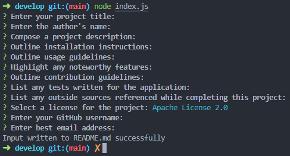
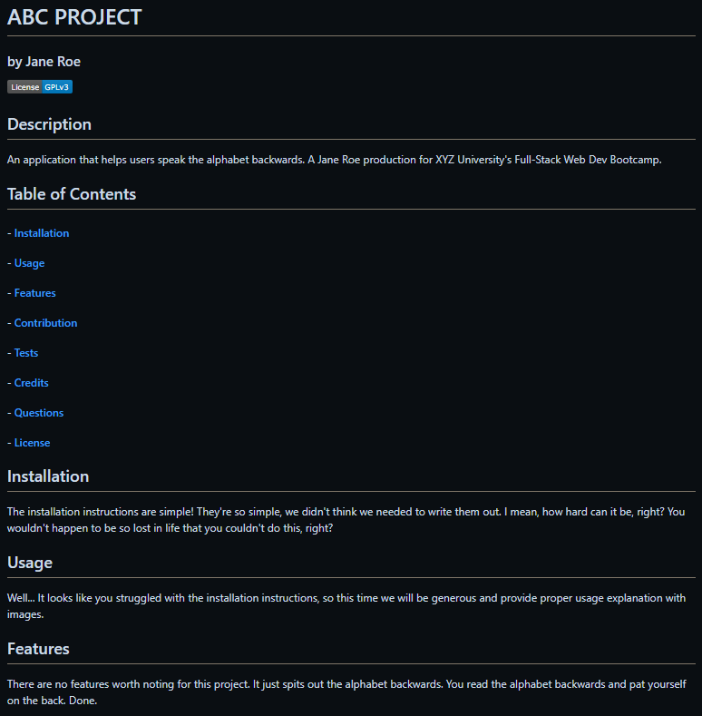
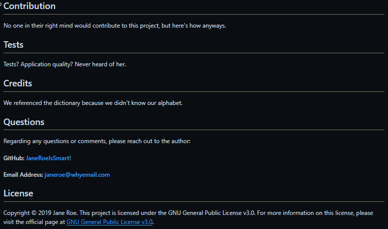

# Matsu README Generator
### by justin (matsu) ferrell

## Description
#### UCSD Full-Stack Bootcamp Challenge 9 - 
A README generator to create a professional README for a new user project.


## Table of Contents
#### - [Usage & Features](#usage_&_features)
#### - [Credits](#credits)
#### - [Questions](#questions)
#### - [License](#license)


## Usage
Walkthrough video and screenshot images for user to get started.

#### Walkthrough Video
Video can be accessed through Google Drive here: [User Guide (Video)](https://drive.google.com/file/d/18qWC1c1mQ9d4lP2ruwaQkr_n4GrAvFzO/view?usp=drive_link).

#### Screenshots from Application
###### Image from Terminal (User Input):

```md

```

###### Images of Example README.md file:

```md

```
```md

```


## Credits
##### ChatGPT 4 -
Tutorial on the usage of maps and their features.
(https://chat.openai.com/)

##### GitHub -
List of license options adapted from GitHub Repo create page.
(https://github.com/)

##### [Lukas Himsel](https://gist.github.com/lukas-h) -
License badge text, colors, and links adapted from their Markdown License Badges repo.
(https://gist.github.com/2a5d00690736b4c3a7ba.git)

##### Screencastify -
Software used to record project submission video (featured in this readme).
(https://www.screencastify.com/)

##### Shields.io -
Used to generate static badges for licenses in README.
(https://shields.io/badges)

##### [Xander Rapstine](https://github.com/Xandromus), [Grace Choi](https://github.com/gachoi06), & The Coding Bootcamp -
Provided starter code (function names / TODOs) for this project.
(https://github.com/coding-boot-camp/potential-enigma.git)


## Questions
#### GitHub profile: [Lifeofmatsu](https://github.com/lifeofmatsu)
#### Email address: jdferrell@health.ucsd.edu

This project: [README Generator Repo](https://github.com/lifeofmatsu/matsu-readme-gen.git)


## License
Copyright (c) 2023 Jus Ferrell

Permission is hereby granted, free of charge, to any person obtaining a copy
of this software and associated documentation files (the "Software"), to deal
in the Software without restriction, including without limitation the rights
to use, copy, modify, merge, publish, distribute, sublicense, and/or sell
copies of the Software, and to permit persons to whom the Software is
furnished to do so, subject to the following conditions:

The above copyright notice and this permission notice shall be included in all
copies or substantial portions of the Software.

THE SOFTWARE IS PROVIDED "AS IS", WITHOUT WARRANTY OF ANY KIND, EXPRESS OR
IMPLIED, INCLUDING BUT NOT LIMITED TO THE WARRANTIES OF MERCHANTABILITY,
FITNESS FOR A PARTICULAR PURPOSE AND NONINFRINGEMENT. IN NO EVENT SHALL THE
AUTHORS OR COPYRIGHT HOLDERS BE LIABLE FOR ANY CLAIM, DAMAGES OR OTHER
LIABILITY, WHETHER IN AN ACTION OF CONTRACT, TORT OR OTHERWISE, ARISING FROM,
OUT OF OR IN CONNECTION WITH THE SOFTWARE OR THE USE OR OTHER DEALINGS IN THE
SOFTWARE.
